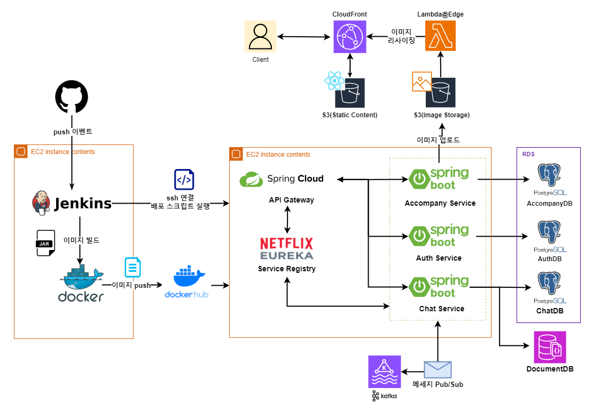

# Together Travel

**투게더 트래블**은
음식, 여행, 취미 생활을 같이 즐길 동행인을 구하는 웹 서비스입니다.

## 기술 스택
|프론트엔드||
|---|---|
|Programming Language||
|Framework||
|Package Manager| |
|Build||
 

|백엔드||
|---|---|
|Programing Language||
|Framework||
|ORM| |
|Messageing Queue||
|Build|
|Deployment Tool|  |

## 아키텍처

